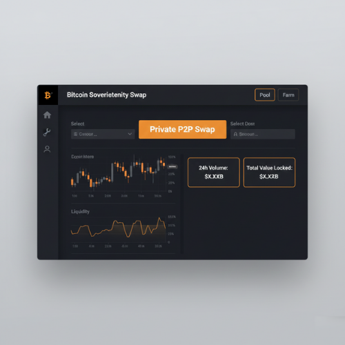

# Bitcoin Sovereignty Swap

Private peer-to-peer Bitcoin swaps with zero-knowledge privacy on Lightning Network.

**Problem:** Bitcoin transactions are public → no financial privacy.  
**Solution:** ZK-powered anonymous swaps (send/receive without revealing amounts or addresses).

**Features:**  
- Fully private transfers  
- Lightning fast & cheap  
- No KYC  

  

**Future:** ZK proofs + Lightning integration for true sovereignty.
